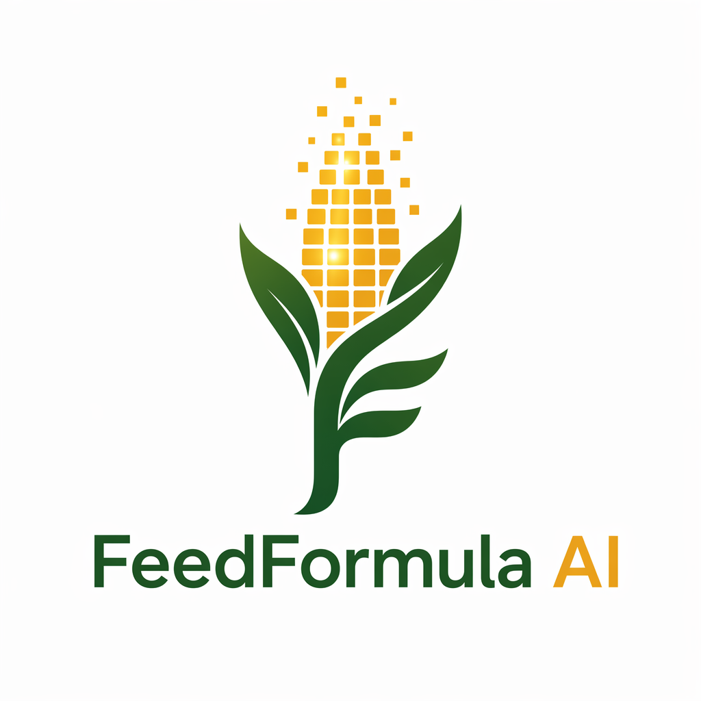

# 🌾 FeedFormula AI

> **L’intelligence agricole africaine qui formule, conseille et engage en 30 secondes — dans la langue de l’éleveur.**

**Demo live** · **Discord** · **Présentation**

- **Demo live** : `/app`  
- **Discord** : `assets/banniere_discord.png`  
- **Présentation** : `frontend/investisseurs.html`

---

## Table des matières

1. [Vision](#vision)
2. [Description](#description)
3. [Les 8 modules](#les-8-modules)
4. [Stack technologique](#stack-technologique)
5. [Installation locale en 5 étapes](#installation-locale-en-5-étapes)
6. [Variables d’environnement](#variables-denvironnement)
7. [API docs](#api-docs)
8. [Offres commerciales](#offres-commerciales)
9. [Roadmap An 1 / An 2 / An 3](#roadmap-an-1--an-2--an-3)
10. [Contribution](#contribution)
11. [Licence](#licence)
12. [Contact](#contact)

---

## Vision

FeedFormula AI est une plateforme **web + mobile + IA** pensée pour l’élevage africain. Elle réunit conseil nutritionnel, santé animale, reproduction, gestion de ferme, apprentissage, contenu, communauté et gamification dans une expérience fluide, moderne et résiliente, même avec une connexion 3G.

---

## Description

FeedFormula AI a été conçu pour résoudre un problème très concret : donner aux éleveurs un accès immédiat à des recommandations utiles, compréhensibles et actionnables. Au lieu de multiplier les outils, la plateforme centralise les usages essentiels dans un seul produit cohérent, avec une navigation simple et un langage adapté au terrain.

L’approche est résolument panafricaine. Grâce à l’intégration multilingue via l’API Afri, la solution peut répondre en français, en anglais et dans de nombreuses langues africaines, dont plusieurs langues béninoises. L’objectif n’est pas seulement de traduire, mais de rendre la technologie réellement utilisable par les éleveurs, les coopératives, les techniciens et les entrepreneurs agricoles.

Enfin, FeedFormula AI s’inscrit dans une logique startup internationale : architecture modulaire, expérience premium, monétisation progressive, design orienté adoption, et vision d’expansion régionale. La plateforme est pensée pour démarrer vite, convaincre avec une démonstration claire, puis s’industrialiser avec des fondations solides.

---

## Les 8 modules

| Module | Rôle | Valeur produit |
|---|---|---|
| **NutriCore** | Formulation de ration | Calcule une ration optimale en tenant compte des ingrédients, des prix et des objectifs de production |
| **VetScan** | Santé animale | Analyse photo, voix et symptômes pour fournir une suspicion, un niveau de risque et un premier protocole |
| **ReproTrack** | Reproduction | Suit les cycles, les dates clés et les alertes de fertilité |
| **PastureMap** | Pâturages intelligents | Exploite les données satellite pour aider au suivi des zones de pâture |
| **FarmManager** | Gestion de ferme | Centralise journal, dépenses, revenus, stock et reporting |
| **FarmAcademy** | Formation | Propose des cours, quiz et parcours pédagogiques multilingues |
| **FarmCast** | Contenu automatique | Génère scripts, audio et contenus vidéo pour la vulgarisation agricole |
| **FarmCommunity** | Communauté & marketplace | Connecte les éleveurs, les annonces, les échanges et la modération |

---

## Stack technologique

- **Frontend web** : HTML, CSS, JavaScript, React.js selon les écrans et les parcours
- **Mobile** : React Native / Expo
- **Backend** : FastAPI, Python 3.11
- **Base de données** : PostgreSQL, avec compatibilité SQLite pour certains contextes de développement
- **Cache / performance** : Redis et cache mémoire applicatif
- **IA** : API Afri, modèles de chat, transcription, voix et génération multimodale
- **Authentification** : JWT, rôles, sécurité par environnement
- **Observabilité** : logs structurés, suivi des erreurs, contrôle des performances
- **Média** : images, audio, vidéo, exports PDF et assets de branding
- **Déploiement** : Vercel pour les assets et le frontend statique, backend Python exposé via routes API

---

## Installation locale en 5 étapes

1. **Cloner le dépôt** et se placer à la racine du projet.
2. **Créer un environnement Python** pour le backend puis installer les dépendances avec `pip install -r backend/requirements.txt`.
3. **Créer le fichier `.env`** à la racine et renseigner les variables d’environnement nécessaires.
4. **Lancer l’API** avec `uvicorn backend.main:app --reload --port 8000` ou via la commande d’exécution de votre environnement.
5. **Ouvrir le frontend** dans le navigateur via les pages du dossier `frontend/`, puis tester les parcours principaux en local.

> Le frontend du projet est majoritairement statique, ce qui permet une mise en route rapide sans chaîne de build complexe.

---

## Variables d’environnement

### Socle applicatif

| Variable | Description |
|---|---|
| `APP_ENV` | Environnement d’exécution : `development`, `production`, etc. |
| `SECRET_KEY` | Clé secrète utilisée pour la sécurité et les jetons |
| `JWT_ALGORITHM` | Algorithme de signature des JWT |
| `JWT_OTP_EXPIRE_DAYS` | Durée de vie des jetons liés à certains flux d’authentification |
| `OTP_EXPIRE_MINUTES` | Durée de validité des OTP |
| `OTP_MAX_ATTEMPTS` | Nombre maximal de tentatives OTP |
| `DATABASE_URL` | URL de base de données requise en production |

### API et IA

| Variable | Description |
|---|---|
| `AFRI_BASE_URL` | URL de base de l’API Afri |
| `AFRI_API_BASE_URL` | Alias supporté pour la même base API |
| `AFRI_API_KEY` | Clé d’accès à l’API Afri |
| `AFRI_CHAT_MODEL` | Modèle de chat principal |
| `AFRI_STT_MODEL` | Modèle de transcription audio |
| `AFRI_TTS_MODEL` | Modèle de synthèse vocale |
| `AFRI_TTS_VOICE` | Voix utilisée pour la restitution audio |
| `AFRI_IMAGE_MODEL` | Modèle d’images utilisé par certains flux |
| `AFRI_TIMEOUT_SECONDS` | Timeout réseau pour les appels IA |
| `AFRI_FARMMANAGER_MODEL` | Modèle dédié à certains assistants métiers |
| `OPENAI_API_KEY` | Fallback éventuel pour certains outils internes |
| `OPENAI_BASE_URL` | Base URL de fallback éventuelle |

### Frontend

| Variable | Description |
|---|---|
| `window.API_BASE` | Base API côté navigateur si définie par le runtime |
| `FEEDFORMULA_API_BASE_URL` | Base API globale supportée par certains écrans |
| `__FEEDFORMULA_API_BASE_URL__` | Variante de configuration supportée par le frontend |

---

## API docs

La documentation interactive de l’API FastAPI est disponible via Swagger/OpenAPI : **`/docs`**.

- Exemple local : `http://127.0.0.1:8000/docs`
- Documentation technique complémentaire : `docs/ARCHITECTURE.md`

---

## Offres commerciales

| Offre | Prix | Positionnement |
|---|---:|---|
| **FREE** | 0 FCFA / mois | Découverte et premier usage |
| **STANDARD** | 2 000 FCFA / mois | Usage individuel régulier |
| **PREMIUM** | 8 000 FCFA / mois | Exploitations actives et besoins avancés |
| **VIP** | 25 000 FCFA / mois | Fermes structurées et accompagnement renforcé |
| **GOLD** | 75 000 FCFA / mois | Exploitations intensives et organisations professionnelles |

---

## Roadmap An 1 / An 2 / An 3

### An 1 — Validation produit et traction
- Stabiliser le MVP complet autour des 8 modules
- Consolider l’adoption au Bénin
- Mesurer la rétention, l’usage mobile et la valeur perçue
- Renforcer le multilingue, la voix et les parcours terrain
- Sécuriser les premiers clients payants et les premiers partenariats

### An 2 — Expansion régionale
- Déploiement dans plusieurs pays d’Afrique de l’Ouest
- Renforcement de la couche marketplace et communauté
- Développement de contenus localisés par pays et par langue
- Industrialisation des parcours support, onboarding et fidélisation
- Montée en puissance du B2B avec coopératives, ONG et programmes agricoles

### An 3 — Plateforme panafricaine
- Extension multi-régions et multiplication des langues supportées
- Renforcement de la data platform et des recommandations intelligentes
- Déploiement de services premium à grande échelle
- Constitution d’un écosystème de partenaires et d’intégrateurs
- Positionnement de FeedFormula AI comme référence agritech panafricaine

---

## Contribution

Les contributions sont les bienvenues, à condition de respecter l’esprit produit et les contraintes de terrain.

### Avant de contribuer
- Lire `docs/ARCHITECTURE.md` pour comprendre les fondations
- Vérifier les rapports techniques les plus récents dans `docs/`
- Préserver la compatibilité des parcours mobile et basse connexion
- Documenter toute modification métier ou API

### Bonnes pratiques
- Commits courts, lisibles et orientés valeur
- Préférer des changements ciblés plutôt que des refontes larges
- Ajouter des tests ou des validations quand c’est pertinent
- Respecter les secrets et ne jamais les exposer dans le code

### Flux recommandé
1. Ouvrir une branche dédiée
2. Implémenter la modification
3. Vérifier localement
4. Mettre à jour la documentation si nécessaire
5. Soumettre une revue claire et contextualisée

---

## Licence

Projet sous **licence propriétaire `UNLICENSED`**. Toute utilisation, redistribution ou réutilisation du code doit être validée par le porteur du projet.

---

## Contact

**Porteur du projet** : **Leonel TOGBE**  
**Rôle** : Technicien Agricole | Licence en Production Animale  
**Email** : `leonel.togbe@feedformula.ai`

---

## À propos

FeedFormula AI est conçu pour donner à l’élevage africain une infrastructure numérique moderne, multilingue et utile, avec un produit premium capable de convaincre des utilisateurs, des partenaires et des investisseurs.

**Message clé :** une intelligence africaine, pour des fermes africaines, avec une ambition internationale.
